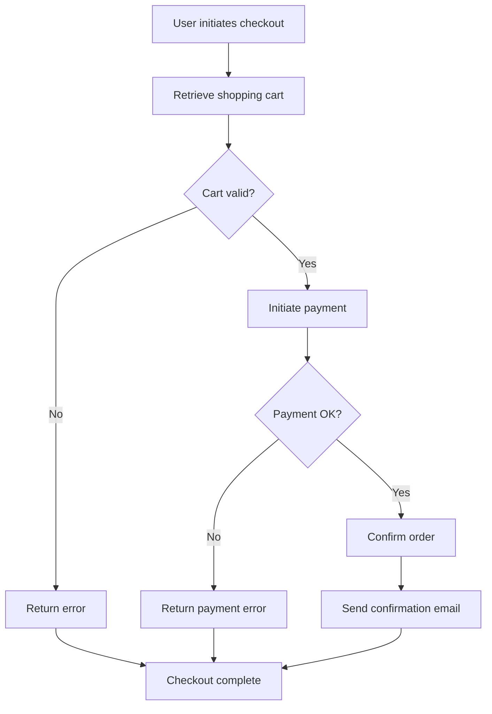
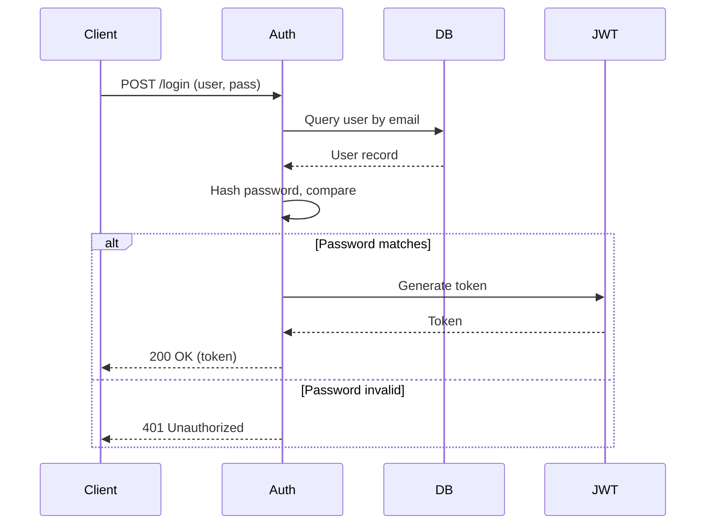
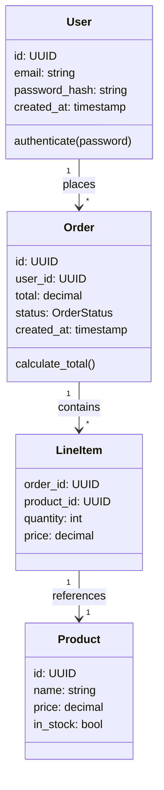
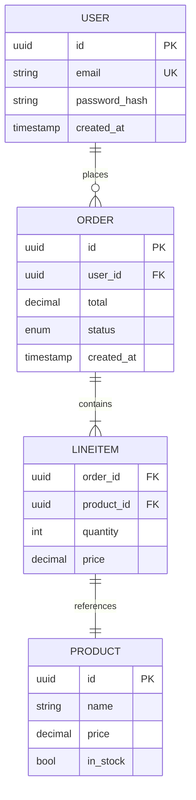
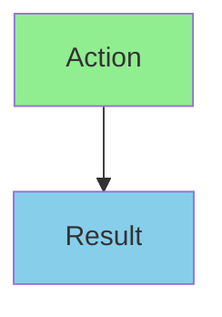
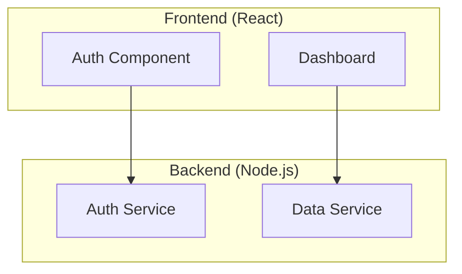
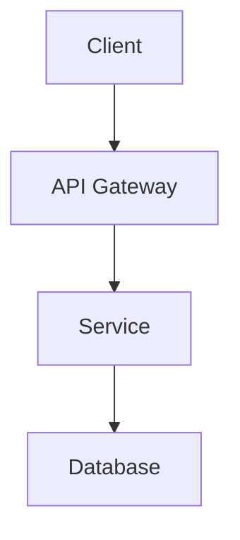
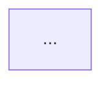
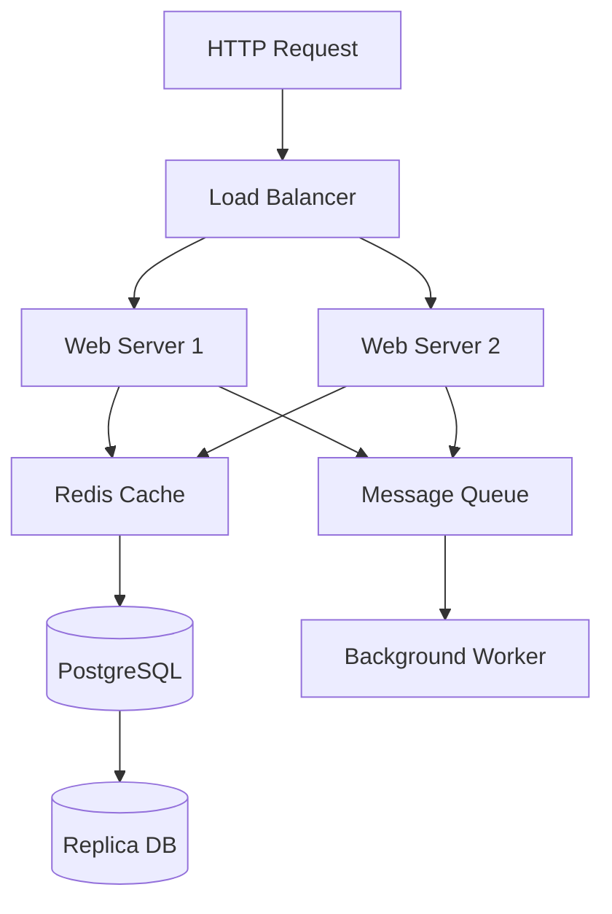
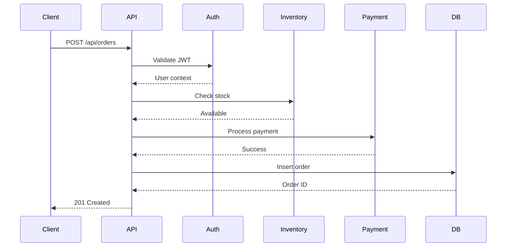

# Diagram Generation Guide

Mermaid diagram conventions and PNG rendering for specification documents.

---

## Overview

Specifications benefit from visual diagrams to clarify architecture, data flows, interactions, and relationships. This guide covers:
- Mermaid diagram types (flowchart, sequence, class, ER)
- When to use each type
- Mermaid syntax essentials
- PNG rendering via mermaid-cli (mmdc) availability check
- Fallback strategy when mmdc is unavailable

---

## Diagram Types & When to Use

### Flowchart (Process Flow)
**Use for:** Sequential processes, decision logic, data flow start-to-end, system workflows

**Example: Data flow for a checkout process**


**Mermaid syntax:**
- `flowchart TD` — Top-down direction (or `LR` for left-right)
- `[rectangle]` — Process/action
- `{diamond}` — Decision (yes/no)
- `(rounded)` — Start/end
- `-->` — Flow arrow
- `-->|Label|` — Labeled arrow

### Sequence Diagram
**Use for:** Multi-actor interactions, API request/response, protocol flows, authentication sequences

**Example: API authentication flow**


**Mermaid syntax:**
- `sequenceDiagram` — Opens diagram
- `Actor->>Actor: Message` — Synchronous call
- `Actor-->>Actor: Response` — Return/async
- `alt / else` — Conditional blocks
- `par` — Parallel calls
- `loop` — Repeated calls

### Class Diagram
**Use for:** Object-oriented design, domain models, type hierarchies, relationships between entities

**Example: E-commerce domain model**


**Mermaid syntax:**
- `class ClassName { attributes methods }` — Class definition
- `Class1 "cardinality" --> "cardinality" Class2 : relationship` — Associations
- `-|>` — Inheritance
- `--` — Association

### ER Diagram (Entity-Relationship)
**Use for:** Database schema, data relationships, cardinality, normalization

**Example: Order management schema**


**Mermaid syntax:**
- `entity || relationship {} : label` — Entity with relationship
- `PK` — Primary key
- `FK` — Foreign key
- `UK` — Unique key
- `||--o{` — One-to-many (cardinality)
- `||--||` — One-to-one

---

## Mermaid Syntax Essentials

### Common Patterns

**Naming & identifiers:**
- Use PascalCase for entity/class/actor names
- Use snake_case for attributes/fields
- Keep labels concise (max 40 chars per node)

**Coloring (optional):**


**Subgraphs (grouping):**


---

## PNG Rendering

### Availability Check

Before rendering Mermaid source to PNG, check for mermaid-cli availability:

**Step 1: ToolSearch for Playwright MCP**

Use `ToolSearch` with query `"select:mermaid"` or similar to check if a Mermaid MCP is available.

**Step 2: CLI Fallback**

If no MCP, check for local CLI:
```bash
which mmdc
# or on Windows:
where mmdc
```

**Step 3: Render if Available**

If `mmdc` is found:
```bash
mmdc -i input.mmd -o output.png
```

**Step 4: Embed in Spec**

- If PNG generated: `` (relative path)
- If unavailable: Embed Mermaid source and note the requirement

### Fallback Message

If `mmdc` is not installed, embed the message:

```markdown
**Note:** PNG rendering requires mermaid-cli. To generate:

```bash
npm install -g @mermaid-js/mermaid-cli
mmdc -i diagram.mmd -o diagram.png
```

Or use [Mermaid Live Editor](https://mermaid.live) to render online.
```

---

## When to Add Diagrams to Specs

### Required Diagrams
- **Architecture spec:** Data-flow flowchart (start to end)
- **API endpoint spec:** Sequence diagram (request/response with auth if applicable)

### Optional but Recommended
- **Functionality spec:** Flowchart for complex business logic
- **UI/UX design spec:** Class diagram for state/interaction model
- **General spec:** Whenever behavior is clarified by a visual

### When NOT to Add Diagrams
- Simple CRUD operations (sufficient in text)
- Trivial data models (< 3 entities)
- High-level overviews already covered elsewhere

---

## Embedding Diagrams in Markdown

### Direct Mermaid Syntax (Most Platforms)

````markdown
## Architecture


````

### Markdown with Image Reference

```markdown
## Architecture


*Generated from: [diagram.mmd](diagram.mmd)*
```

### Fallback with Source Code

```markdown
## Data Flow



**Or render the above as PNG:**
```
mmdc -i flow.mmd -o flow.png
```
```

---

## Best Practices

1. **Keep diagrams simple:** 5-15 nodes max; split into multiple diagrams if needed
2. **Use consistent naming:** Entity names match schema/code, attribute names match API contracts
3. **Label relationships:** Every arrow should have a label (except in flowcharts where flow direction is obvious)
4. **Directional consistency:** Left-to-right (LR) or top-down (TD) per context; don't mix in one diagram
5. **Color sparingly:** Use color to highlight critical paths or layers, not for decoration
6. **Cardinality clarity:** ER diagrams MUST show 1:1, 1:N, N:M relationships explicitly

---

## Examples in Specs

### Architecture Spec Data Flow


### API Endpoint Spec Sequence


---

## Troubleshooting

**Mermaid diagram not rendering:**
- Check syntax for typos (flowchart vs flow, etc.)
- Validate at [mermaid.live](https://mermaid.live)
- Ensure no circular references (in ER diagrams)

**mmdc command not found:**
- Install: `npm install -g @mermaid-js/mermaid-cli`
- Check PATH: `echo $PATH`
- On Windows, may need to restart shell after install

**PNG file too large:**
- Simplify diagram (fewer nodes)
- Use `--width` and `--height` flags: `mmdc -i input.mmd -o output.png --width 1200 --height 800`
